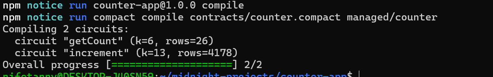
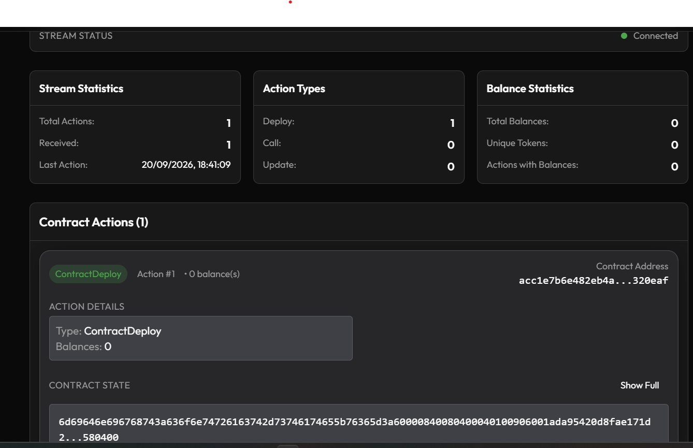

# midnight-privacy-counter

> A secret-gated counter: anyone can read the public tally, but only the holder of a private secret can increment it — without ever revealing that secret on-chain.

## Contract Address

| Network  | Address                          |
|----------|-----------------------------------|
| Preview  | `acc1e7b6e482eb4a21e731241070119f2a38b128b7b4da6d59068a8048320eaf` |
| Preprod  | [PASTE ADDRESS AFTER DEPLOY]     |

## What This Does

`counter.compact` is a public counter with an access-control twist. Anyone can read the current count. But incrementing it requires proving you know a secret value — without ever putting that secret on the blockchain. The contract only ever sees and stores a one-way hash (commitment) of the secret, set once at deploy time; every later call re-proves knowledge of the secret against that commitment using a zero-knowledge circuit.

## Privacy Model

- **PUBLIC** (on-chain, visible to anyone):
  - `count` — how many times the counter has been successfully incremented.
  - `ownerKey` — a hash commitment to the owner's secret, set once at deploy. This reveals nothing about the secret itself, only a fingerprint of it.
- **PRIVATE** (private witness, supplied off-chain, never on-chain):
  - The owner's raw secret (32 bytes), read fresh from a local file (`.counter-owner-secret`) on every call via the `secretKey` witness. It is never included in any transaction or stored in the ledger.
- **What the user PROVES without revealing**: calling `increment` proves the caller knows the secret whose hash matches `ownerKey` — without the secret, or anything derived from it besides the fixed public commitment, ever leaving the caller's machine.

## Tech Stack

- Midnight Network, Compact language (compiler pinned in `.compact-version`), Node.js v22+, Docker

## Prerequisites

- Node.js v22 or later
- Docker with Compose v2 (for the local devnet / proof server)
- The [Compact compiler](https://docs.midnight.network/getting-started/installation), pinned to the version in `.compact-version`:
  ```bash
  compact update "$(cat .compact-version)"
  ```

> **On Windows:** the npm scripts in this project run natively (PowerShell or cmd.exe), but the Compact compiler publishes no native Windows binary — so `npm run compile`, and `npm run setup` which calls it, need to run inside WSL.

## Setup

```bash
git clone <this-repo-url>
cd counter-app
npm install
npm run setup        # starts local devnet, compiles, deploys to `undeployed`
npm run test:e2e     # reconnects to the deployed contract, confirms it's live
```

`npm run setup` runs end-to-end with no prompts:

1. `docker compose up -d --wait` — starts a local Midnight devnet (node, indexer, proof-server) for the `undeployed` network, or just the proof-server for `preview`/`preprod`.
2. `npm run compile` — compiles `contracts/counter.compact` to `managed/counter/`.
3. `npm run deploy` — derives/loads a wallet, funds it (local genesis seed, or a public-network faucet), generates a fresh owner secret (`.counter-owner-secret`), deploys the contract with a commitment to that secret, and writes `.midnight-state.json`.

### Deploying to a public network

```bash
npm run setup -- --network preview   # or --network preprod
```

On first use, this prints the wallet's address and a faucet URL, then pauses — fund the address at the faucet, and it continues automatically once funds arrive (10-minute default timeout, override with `MIDNIGHT_FAUCET_TIMEOUT_MS`). The active network is sticky (`npm run network preview` to switch without deploying).

### Interacting with the deployed contract

```bash
npm run cli
```

Menu options: increment the counter (requires the owner secret from `.counter-owner-secret`), read the current count, or check wallet balance.

## Run Tests

```bash
npm test        # unit tests: contracts/counter.compact circuits, via the local Compact simulator (no network needed)
npm run test:e2e   # smoke test against a live deployment
```

`tests/counter.test.ts` covers:
- Circuit logic — `getCount` reads back the ledger correctly.
- State transitions — `increment` advances `count` by exactly 1 each call.
- Access control — `increment` with the wrong secret is rejected and `count` is unchanged.
- Privacy — the raw secret never appears anywhere in the decoded public ledger state.

## Initial Idea
This project was built as part of the Midnight Builder Challenge (Level 1). 
I picked a simple counter contract to learn the fundamentals of Compact — 
specifically how public ledger state and private witness inputs work 
together, and how disclose() lets you selectively reveal private data 
when needed.

## Screenshots



## Project structure

```
counter-app/
├── contracts/
│   └── counter.compact          # Compact source: public count + private-secret access control
├── managed/                     # compiled circuits/keys (generated — `npm run compile`, gitignored)
├── src/                         # deploy/CLI/wallet scripts (frontend added in Level 2)
├── tests/
│   └── counter.test.ts          # unit tests against the local Compact simulator
├── scripts/
│   └── e2e-check.ts             # smoke + read-back check against a live deployment
├── .github/
│   └── workflows/
│       └── ci.yml                # compile + type-check + unit tests on push/PR
├── docker-compose.yml            # local devnet: node + indexer + proof-server
├── .compact-version               # pinned Compact compiler version
├── .midnight-state.json          # written by deploy (gitignored — holds wallet seeds/deploy addresses)
├── .counter-owner-secret          # the counter's private owner secret (gitignored)
├── README.md
└── package.json
```

## Networks

| Network | When to use | Default? |
|---|---|---|
| `undeployed` | Local devnet bundled in `docker-compose.yml`. Genesis seed is hardcoded; no funding needed. | yes |
| `preview` | Public preview testnet. Faucet at `https://midnight-tmnight-preview.nethermind.dev`. |  |
| `preprod` | Public preprod testnet. Faucet at `https://midnight-tmnight-preprod.nethermind.dev`. |  |

```sh
npm run network preview         # switch active network
npm run network                 # print current active network
```

Wallet seeds/mnemonics and deploy addresses per network are stored in `.midnight-state.json` (gitignored). Public-network wallets generate a 24-word BIP-39 recovery phrase on first use — back it up if you fund a wallet you care about.
